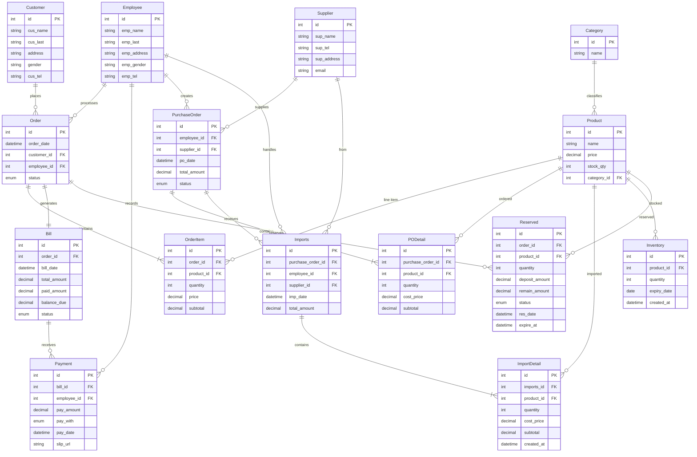

# ບົດທີ 3 — ໜ້າ 37–45

> ແປຈາກ `fixnew (2).pdf` — ສ່ວນ **ER Diagram**, **Data Relation** ແລະ **Data Dictionary**  
> ໂຄງການ: **ລະບົບການຈັດການຮ້ານ The 196 Haus**

---

## 3.3.5 ແຜນພາບຄວາມສຳພັນຂອງຂໍ້ມູນ (ER: Entity Relationship)

**ຮູບທີ 3.11** ສະແດງຄວາມສຳພັນຂໍ້ມູນ (ER: Entity Relationship)

ແຜນພາບ ER ຂ້າງລຸ່ມສະແດງ Entity ຫຼັກ ແລະ ຄວາມສຳພັນລະຫວ່າງຕາຕະລາງໃນລະບົບ:

> **ໝາຍເຫດ:** ໃນໂຄດ Django ຈິງ Entity ເທົ່າກັບ model — `OrderItem` (= Order_detail), `Category` (= Cas), `PurchaseOrder` (= Purchase_order), `PODetail` (= PO_detail).

---

## 3.3.6 ຄວາມສຳພັນຂອງຂໍ້ມູນ (Data Relation)

### Employee

| Column | Description |
|--------|-------------|
| Emp_ID | ລະຫັດພະນັກງານ (PK) |
| Emp_Name | ຊື່ພະນັກງານ |
| Emp_Last | ນາມສະກຸນ |
| Emp_Address | ທີ່ຢູ່ |
| Emp_Gender | ເພດ |
| Emp_Tel | ເບີໂທ |
| Email | ອີເມວ |
| Password | ລະຫັດຜ່ານ |

### Customer

| Column | Description |
|--------|-------------|
| Cus_ID | ລະຫັດລູກຄ້າ (PK) |
| Cus_Name | ຊື່ລູກຄ້າ |
| Cus_Last | ນາມສະກຸນ |
| Gender | ເພດ |
| Address | ທີ່ຢູ່ |
| Password | ລະຫັດຜ່ານ |
| Email | ອີເມວ |
| Cus_Tel | ເບີໂທ |

### Supplier

| Column | Description |
|--------|-------------|
| Sup_ID | ລະຫັດຜູ້ສະໜອງ (PK) |
| Sup_Name | ຊື່ຜູ້ສະໜອງ |
| Sup_Tel | ເບີຕິດຕໍ່ |
| Sup_Address | ທີ່ຢູ່ |
| Email | ອີເມວ |

### Category

| Column | Description |
|--------|-------------|
| Cas_ID | ລະຫັດໝວດໝູ່ສິນຄ້າ (PK) |
| Cas_Name | ຊື່ໝວດໝູ່ສິນຄ້າ |

### Product

| Column | Description |
|--------|-------------|
| Pro_ID | ລະຫັດສິນຄ້າ (PK) |
| Pro_Name | ຊື່ສິນຄ້າ |
| Price | ລາຄາສິນຄ້າ |
| Img_path | ຮູບພາບສິນຄ້າ |
| Created_at | ວັນທີສ້າງ |
| Cas_ID | ລະຫັດໝວດໝູ່ (FK → Category) |
| Description | ຄຳອະທິບາຍສິນຄ້າ |

### Orders

| Column | Description |
|--------|-------------|
| Order_ID | ລະຫັດສັ່ງຊື້ (PK) |
| Order_date | ວັນທີສັ່ງຊື້ |
| Cus_ID | ລະຫັດລູກຄ້າ (FK → Customer) |
| Emp_ID | ລະຫັດພະນັກງານ (FK → Employee) |
| Status | PENDING, RESERVED, COMPLETED, CANCELLED |

### Order_detail (OrderItem)

| Column | Description |
|--------|-------------|
| Ord_ID | ລະຫັດລາຍລະອຽດສັ່ງຊື້ (PK) |
| Order_ID | ລະຫັດສັ່ງຊື້ (FK → Orders) |
| Pro_ID | ລະຫັດສິນຄ້າ (FK → Product) |
| Quantity | ຈຳນວນສັ່ງຊື້ |
| Price | ລາຄາສິນຄ້າ |
| Subtotal | ລາຄາລວມ |

### Bill

| Column | Description |
|--------|-------------|
| Bill_ID | ລະຫັດໃບບິນ (PK) |
| Order_ID | ລະຫັດສັ່ງຊື້ (FK → Orders) |
| Bill_date | ວັນທີອອກໃບບິນ |
| Total_amount | ລວມເງິນ |
| Paid_amount | ຈຳນວນເງິນທີ່ຊຳລະ |
| Balance_due | ຈຳນວນເງິນທີ່ຄ້າງຊຳລະ |
| Status | PENDING, PARTIAL, PAID |

### Payment

| Column | Description |
|--------|-------------|
| Pay_ID | ລະຫັດການຊຳລະ (PK) |
| Bill_ID | ລະຫັດໃບບິນ (FK → Bill) |
| Emp_ID | ລະຫັດພະນັກງານ (FK → Employee) |
| Pay_amount | ຈຳນວນເງິນທີ່ຈ່າຍ |
| Pay_with | CASH, TRANSFER, QR |
| Pay_date | ວັນທີຊຳລະ |
| Img_path | ຮູບພາບການໂອນເງິນ |

### Purchase_order

| Column | Description |
|--------|-------------|
| PO_ID | ລະຫັດສັ່ງຊື້ສິນຄ້າເຂົ້າ (PK) |
| Emp_ID | ລະຫັດພະນັກງານ (FK → Employee) |
| Sup_ID | ລະຫັດຜູ້ສະໜອງ (FK → Supplier) |
| PO_date | ວັນທີສັ່ງຊື້ |
| Total_amount | ລາຄາລວມ |
| Status | PENDING, COMPLETED, CANCELLED |

### PO_detail

| Column | Description |
|--------|-------------|
| POd_ID | ລະຫັດລາຍລະອຽດການສັ່ງຊື້ເຂົ້າ (PK) |
| PO_ID | ລະຫັດສັ່ງຊື້ເຂົ້າ (FK → Purchase_order) |
| Pro_ID | ລະຫັດສິນຄ້າ (FK → Product) |
| Quantity | ຈຳນວນຊື້ເຂົ້າ |
| Cost_price | ລາຄາຊື້ເຂົ້າ |
| Subtotal | ລາຄາລວມ |

### Imports

| Column | Description |
|--------|-------------|
| Imp_ID | ລະຫັດນຳເຂົ້າ (PK) |
| PO_ID | ລະຫັດສັ່ງຊື້ເຂົ້າ (FK → Purchase_order) |
| Emp_ID | ລະຫັດພະນັກງານ (FK → Employee) |
| Sup_ID | ລະຫັດຜູ້ສະໜອງ (FK → Supplier) |
| Imp_date | ວັນທີນຳເຂົ້າ |
| Total_amount | ລາຄາລວມ |

### Import_detail

| Column | Description |
|--------|-------------|
| Impd_ID | ລະຫັດລາຍລະອຽດນຳເຂົ້າ (PK) |
| Imp_ID | ລະຫັດນຳເຂົ້າ (FK → Imports) |
| Pro_ID | ລະຫັດສິນຄ້າ (FK → Product) |
| Quantity | ຈຳນວນນຳເຂົ້າ |
| Cost_price | ລາຄາສິນຄ້ານຳເຂົ້າ |
| Subtotal | ລາຄາລວມ |
| Create_at | ວັນທີສ້າງ |

### Inventory

| Column | Description |
|--------|-------------|
| INV_ID | ລະຫັດສາງສິນຄ້າ (PK) |
| Pro_ID | ລະຫັດສິນຄ້າ (FK → Product) |
| Quantity | ຈຳນວນສິນຄ້າ |
| Expiry_date | ວັນໝົດອາຍຸ |
| Created_at | ວັນທີໄດ້ຮັບສິນຄ້າ |

### Reserved

| Column | Description |
|--------|-------------|
| Res_ID | ລະຫັດການຈອງ (PK) |
| Order_ID | ລະຫັດສັ່ງຊື້ (FK → Orders) |
| Pro_ID | ລະຫັດສິນຄ້າ (FK → Product) |
| Quantity | ຈຳນວນສິນຄ້າ |
| Deposit_amount | ລາຄາມັດຈຳ |
| Remain_amount | ຈຳນວນເງິນທີ່ຄ້າງຊຳລະ |
| Status | RESERVED, PAID, COMPLETED, CANCELLED |
| Res_date | ວັນທີຈອງ |
| Expire_at | ວັນໝົດອາຍຸການຈອງ |

---

## 3.4 ວັດຈະນານຸກົມຂໍ້ມູນ (Data Dictionary)

### ຕາຕະລາງທີ 3.3 — Employee

| ລ/ດ | Column_Name | Datatype | Size | Key | Reference | Null | Description |
|-----|-------------|----------|------|-----|-----------|------|-------------|
| 1 | Emp_ID | int | 8 | PK | — | NO | ລະຫັດພະນັກງານ |
| 2 | Emp_Name | varchar | 25 | — | — | NO | ຊື່ພະນັກງານ |
| 3 | Emp_Last | varchar | 25 | — | — | NO | ນາມສະກຸນ |
| 4 | Emp_Address | varchar | 100 | — | — | NO | ທີ່ຢູ່ |
| 5 | Emp_Gender | ENUM | — | — | — | NO | ເພດ (Male/Female) |
| 6 | Emp_Tel | char | 12 | — | — | NO | ເບີໂທ |
| 7 | Email | varchar | 50 | — | — | NO | ອີເມວ |
| 8 | Password | char | 20 | — | — | NO | ລະຫັດຜ່ານ |

### ຕາຕະລາງທີ 3.4 — Customer

| ລ/ດ | Column_Name | Datatype | Size | Key | Reference | Null | Description |
|-----|-------------|----------|------|-----|-----------|------|-------------|
| 1 | Cus_ID | int | 8 | PK | — | NO | ລະຫັດລູກຄ້າ |
| 2 | Cus_Name | varchar | 25 | — | — | NO | ຊື່ລູກຄ້າ |
| 3 | Cus_Last | varchar | 25 | — | — | NO | ນາມສະກຸນ |
| 4 | Address | varchar | 100 | — | — | NO | ທີ່ຢູ່ |
| 5 | Gender | ENUM | — | — | — | NO | ເພດ (Male/Female) |
| 6 | Password | char | 20 | — | — | NO | ລະຫັດຜ່ານ |
| 7 | Email | varchar | 50 | — | — | NO | ອີເມວ |
| 8 | Cus_Tel | char | 12 | — | — | NO | ເບີໂທ |

### ຕາຕະລາງທີ 3.5 — Supplier

| ລ/ດ | Column_Name | Datatype | Size | Key | Reference | Null | Description |
|-----|-------------|----------|------|-----|-----------|------|-------------|
| 1 | Sup_ID | int | 8 | PK | — | NO | ລະຫັດຜູ້ສະໜອງ |
| 2 | Sup_Name | varchar | 30 | — | — | NO | ຊື່ຜູ້ສະໜອງ |
| 3 | Sup_Tel | char | 12 | — | — | NO | ເບີຕິດຕໍ່ |
| 4 | Sup_Address | varchar | 100 | — | — | NO | ທີ່ຢູ່ |
| 5 | Email | varchar | 50 | — | — | NO | ອີເມວ |

### ຕາຕະລາງທີ 3.6 — Category

| ລ/ດ | Column_Name | Datatype | Size | Key | Reference | Null | Description |
|-----|-------------|----------|------|-----|-----------|------|-------------|
| 1 | Cas_ID | int | 8 | PK | — | NO | ລະຫັດໝວດໝູ່ສິນຄ້າ |
| 2 | Cas_Name | varchar | 100 | — | — | NO | ຊື່ໝວດໝູ່ສິນຄ້າ |

### ຕາຕະລາງທີ 3.7 — Product

| ລ/ດ | Column_Name | Datatype | Size | Key | Reference | Null | Description |
|-----|-------------|----------|------|-----|-----------|------|-------------|
| 1 | Pro_ID | int | 8 | PK | — | NO | ລະຫັດສິນຄ້າ |
| 2 | Pro_Name | varchar | 100 | — | — | NO | ຊື່ສິນຄ້າ |
| 3 | Price | decimal | 10,2 | — | — | NO | ລາຄາສິນຄ້າ |
| 4 | Img_path | varchar | 255 | — | — | YES | ຮູບພາບສິນຄ້າ |
| 5 | Created_at | datetime | — | — | — | NO | ວັນທີສ້າງ |
| 6 | Cas_ID | int | 8 | FK | Category | NO | ລະຫັດໝວດໝູ່ສິນຄ້າ |
| 7 | Description | text | — | — | — | NO | ຂໍ້ມູນສິນຄ້າ |

### ຕາຕະລາງທີ 3.8 — Orders

| ລ/ດ | Column_Name | Datatype | Size | Key | Reference | Null | Description |
|-----|-------------|----------|------|-----|-----------|------|-------------|
| 1 | Order_ID | int | 8 | PK | — | NO | ລະຫັດສັ່ງຊື້ |
| 2 | Order_date | datetime | — | — | — | NO | ວັນທີສັ່ງຊື້ |
| 3 | Cus_ID | int | 8 | FK | Customer | NO | ລະຫັດລູກຄ້າ |
| 4 | Emp_ID | int | 8 | FK | Employee | NO | ລະຫັດພະນັກງານ |
| 5 | Status | ENUM | — | — | — | NO | PENDING, RESERVED, COMPLETED, CANCELLED |

### ຕາຕະລາງທີ 3.9 — Order_detail

| ລ/ດ | Column_Name | Datatype | Size | Key | Reference | Null | Description |
|-----|-------------|----------|------|-----|-----------|------|-------------|
| 1 | Ord_ID | int | 8 | PK | — | NO | ລະຫັດລາຍລະອຽດສັ່ງຊື້ |
| 2 | Order_ID | int | 8 | FK | Orders | NO | ລະຫັດສັ່ງຊື້ |
| 3 | Pro_ID | int | 8 | FK | Product | NO | ລະຫັດສິນຄ້າ |
| 4 | Quantity | int | 4 | — | — | NO | ຈຳນວນສັ່ງຊື້ |
| 5 | Price | decimal | 10,2 | — | — | NO | ລາຄາສິນຄ້າ |
| 6 | Subtotal | decimal | 10,2 | — | — | NO | ລາຄາລວມ |

### ຕາຕະລາງທີ 3.10 — Bill

| ລ/ດ | Column_Name | Datatype | Size | Key | Reference | Null | Description |
|-----|-------------|----------|------|-----|-----------|------|-------------|
| 1 | Bill_ID | int | 8 | PK | — | NO | ລະຫັດໃບບິນ |
| 2 | Order_ID | int | 8 | FK | Orders | NO | ລະຫັດສັ່ງຊື້ |
| 3 | Bill_date | datetime | — | — | — | NO | ວັນທີອອກໃບບິນ |
| 4 | Total_amount | decimal | 12,2 | — | — | NO | ລວມເງິນ |
| 5 | Paid_amount | decimal | 12,2 | — | — | NO | ຈຳນວນເງິນທີ່ຊຳລະ |
| 6 | Balance_due | decimal | 12,2 | — | — | NO | ຈຳນວນເງິນທີ່ຄ້າງຊຳລະ |
| 7 | Status | ENUM | — | — | — | NO | PENDING, PARTIAL, PAID |

### ຕາຕະລາງທີ 3.11 — Payment

| ລ/ດ | Column_Name | Datatype | Size | Key | Reference | Null | Description |
|-----|-------------|----------|------|-----|-----------|------|-------------|
| 1 | Pay_ID | int | 8 | PK | — | NO | ລະຫັດການຊຳລະ |
| 2 | Bill_ID | int | 8 | FK | Bill | NO | ລະຫັດໃບບິນ |
| 3 | Emp_ID | int | 8 | FK | Employee | NO | ລະຫັດພະນັກງານ |
| 4 | Pay_amount | decimal | 10,2 | — | — | NO | ຈຳນວນເງິນທີ່ຈ່າຍ |
| 5 | Pay_with | ENUM | — | — | — | NO | CASH, TRANSFER, QR |
| 6 | Pay_date | datetime | — | — | — | NO | ວັນທີຊຳລະ |
| 7 | Img_path | varchar | 255 | — | — | YES | ຮູບພາບການໂອນເງິນ |

### ຕາຕະລາງທີ 3.12 — Purchase_order

| ລ/ດ | Column_Name | Datatype | Size | Key | Reference | Null | Description |
|-----|-------------|----------|------|-----|-----------|------|-------------|
| 1 | PO_ID | int | 8 | PK | — | NO | ລະຫັດສັ່ງຊື້ສິນຄ້າເຂົ້າ |
| 2 | Emp_ID | int | 8 | FK | Employee | NO | ລະຫັດພະນັກງານ |
| 3 | Sup_ID | int | 8 | FK | Supplier | NO | ລະຫັດຜູ້ສະໜອງ |
| 4 | PO_date | datetime | — | — | — | NO | ວັນທີສັ່ງຊື້ |
| 5 | Total_amount | decimal | 12,2 | — | — | NO | ລາຄາລວມ |
| 6 | Status | ENUM | — | — | — | NO | PENDING, COMPLETED, CANCELLED |

### ຕາຕະລາງທີ 3.13 — PO_detail

| ລ/ດ | Column_Name | Datatype | Size | Key | Reference | Null | Description |
|-----|-------------|----------|------|-----|-----------|------|-------------|
| 1 | POd_ID | int | 8 | PK | — | NO | ລະຫັດລາຍລະອຽດການສັ່ງຊື້ເຂົ້າ |
| 2 | PO_ID | int | 8 | FK | Purchase_order | NO | ລະຫັດສັ່ງຊື້ເຂົ້າ |
| 3 | Pro_ID | int | 8 | FK | Product | NO | ລະຫັດສິນຄ້າ |
| 4 | Quantity | int | — | — | — | NO | ຈຳນວນຊື້ເຂົ້າ |
| 5 | Cost_price | decimal | 10,2 | — | — | NO | ລາຄາຊື້ເຂົ້າ |
| 6 | Subtotal | decimal | 10,2 | — | — | NO | ລາຄາລວມ |

### ຕາຕະລາງທີ 3.14 — Imports

| ລ/ດ | Column_Name | Datatype | Size | Key | Reference | Null | Description |
|-----|-------------|----------|------|-----|-----------|------|-------------|
| 1 | Imp_ID | int | 8 | PK | — | NO | ລະຫັດນຳເຂົ້າ |
| 2 | PO_ID | int | 8 | FK | Purchase_order | NO | ລະຫັດສັ່ງຊື້ເຂົ້າ |
| 3 | Emp_ID | int | 8 | FK | Employee | NO | ລະຫັດພະນັກງານ |
| 4 | Sup_ID | int | 8 | FK | Supplier | NO | ລະຫັດຜູ້ສະໜອງ |
| 5 | Imp_date | datetime | — | — | — | NO | ວັນທີນຳເຂົ້າ |
| 6 | Total_amount | decimal | 12,2 | — | — | NO | ລາຄາລວມ |

### ຕາຕະລາງທີ 3.15 — Import_detail

| ລ/ດ | Column_Name | Datatype | Size | Key | Reference | Null | Description |
|-----|-------------|----------|------|-----|-----------|------|-------------|
| 1 | Impd_ID | int | 8 | PK | — | NO | ລະຫັດລາຍລະອຽດນຳເຂົ້າ |
| 2 | Imp_ID | int | 8 | FK | Imports | NO | ລະຫັດນຳເຂົ້າ |
| 3 | Pro_ID | int | 8 | FK | Product | NO | ລະຫັດສິນຄ້າ |
| 4 | Quantity | int | — | — | — | NO | ຈຳນວນນຳເຂົ້າສິນຄ້າ |
| 5 | Cost_price | decimal | 10,2 | — | — | NO | ລາຄາສິນຄ້ານຳເຂົ້າ |
| 6 | Subtotal | decimal | 10,2 | — | — | NO | ລາຄາລວມ |

### ຕາຕະລາງທີ 3.16 — Inventory

| ລ/ດ | Column_Name | Datatype | Size | Key | Reference | Null | Description |
|-----|-------------|----------|------|-----|-----------|------|-------------|
| 1 | INV_ID | int | 8 | PK | — | NO | ລະຫັດສາງສິນຄ້າ |
| 2 | Pro_ID | int | 8 | FK | Product | NO | ລະຫັດສິນຄ້າ |
| 3 | Quantity | int | — | — | — | NO | ຈຳນວນສິນຄ້າ |
| 4 | Expiry_date | date | — | — | — | NO | ວັນໝົດອາຍຸ |
| 5 | Created_at | datetime | — | — | — | NO | ວັນທີໄດ້ຮັບສິນຄ້າ |

### ຕາຕະລາງທີ 3.17 — Reserved

| ລ/ດ | Column_Name | Datatype | Size | Key | Reference | Null | Description |
|-----|-------------|----------|------|-----|-----------|------|-------------|
| 1 | Res_ID | int | 8 | PK | — | NO | ລະຫັດການຈອງ |
| 2 | Order_ID | int | 8 | FK | Orders | NO | ລະຫັດສັ່ງຊື້ |
| 3 | Pro_ID | int | 8 | FK | Product | NO | ລະຫັດສິນຄ້າ |
| 4 | Quantity | int | — | — | — | NO | ຈຳນວນສິນຄ້າ |
| 5 | Deposit_amount | decimal | 10,2 | — | — | NO | ລາຄາມັດຈຳ |
| 6 | Remain_amount | decimal | 10,2 | — | — | NO | ຈຳນວນເງິນທີ່ຄ້າງຊຳລະ |
| 7 | Status | ENUM | — | — | — | NO | RESERVED, PAID, COMPLETED, CANCELLED |
| 8 | Res_date | datetime | — | — | — | NO | ວັນທີຈອງ |
| 9 | Expire_at | datetime | — | — | — | NO | ວັນໝົດອາຍຸການຈອງ |

---

## ການເຊື່ອມກັບໂຄງການ Django ຈິງ

| ໃນບົດ (PDF) | Django model | App |
|-------------|--------------|-----|
| Employee | `Employee` | `apps/store` |
| Customer | `Customer` | `apps/store` |
| Supplier | `Supplier` | `apps/inventory` |
| Category | `Category` | `apps/catalog` |
| Product | `Product` | `apps/catalog` |
| Orders | `Order` | `apps/sales` |
| Order_detail | `OrderItem` | `apps/sales` |
| Bill | `Bill` | `apps/sales` |
| Payment | `Payment` | `apps/sales` |
| Purchase_order | `PurchaseOrder` | `apps/inventory` |
| PO_detail | `PODetail` | `apps/inventory` |
| Imports | `Imports` | `apps/inventory` |
| Import_detail | `ImportDetail` | `apps/inventory` |
| Inventory | `Inventory` | `apps/inventory` |
| Reserved | `Reserved` | `apps/sales` |

ເບິ່ງໂຄງສ້າງລະບົບເພີ່ມເຕີມໄດ້ທີ່ [ARCHITECTURE.md](ARCHITECTURE.md)
